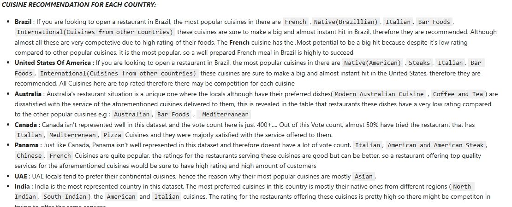
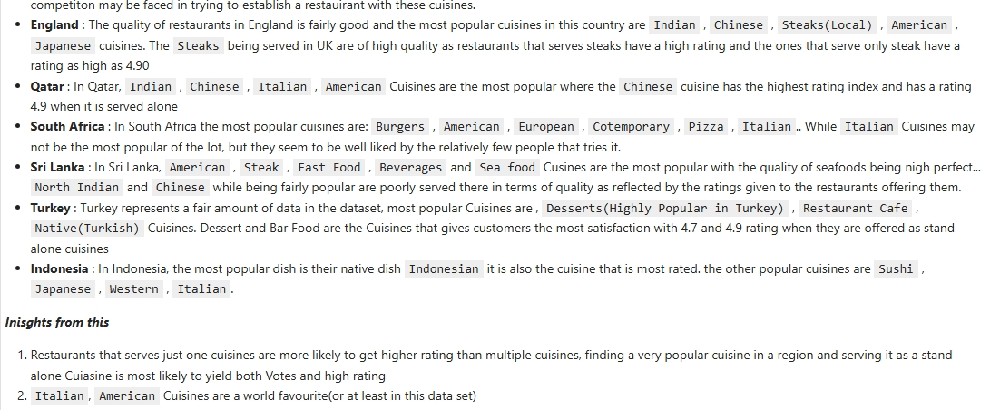

{
 "cells": [
  {
   "cell_type": "markdown",
   "id": "fd2599d4-bc3c-4050-b78b-f17b14835916",
   "metadata": {},
   "source": [
    "# Predicting Restaurant's Rating"
   ]
  },
  {
   "cell_type": "markdown",
   "id": "dbb5120a-b0d9-4246-aa72-516ea342d24d",
   "metadata": {},
   "source": [
    "## Project Objective\n",
    "*The primary objective for this project is to develop a machine learning model that helps in predicting the rating a restaurant would have based on key features such as*\n",
    "\n",
    "* Cuisines(The dishes served by the restaurant)\n",
    "* Country\n",
    "* Price range\n",
    "* Average Cost for two\n",
    "* Votes\n",
    "\n",
    "*By analysing these key features, deep insights were drawn on how they affect the eventual average rating each restaurant was given to help in maximising input to output for these restaurants, and a predictive model was developed to help in getting the perfect services to render to give the best satisfaction to customers and invariably give a higher rating to such restaurants*"
   ]
  },
  {
   "cell_type": "markdown",
   "id": "93021606-bd84-4618-82dc-9af0a249cd50",
   "metadata": {},
   "source": [
    "## Dataset\n",
    "* Rows: 9551 entries\n",
    "* Columns/Features: 21\n",
    "* Target Variable: Aggregate Rating(Average Rating customers give to each restaurant after patronage).\n",
    "\n",
    "\n",
    "##### Characteristics of the **Dataset** :\n",
    "* Greatly Skewed Features(e.g Average Cost For Two)\n",
    "* Null Values(Target Variable)\n",
    "* Need for Feature Engineering for easy interpretability and for model building"
   ]
  },
  {
   "cell_type": "markdown",
   "id": "466302f5-b781-4398-994e-9292e7f21304",
   "metadata": {},
   "source": [
    "## Tools and Libraries\n",
    "* Python Libraries( Pandas, Numpy, Matplotlib, Seaborn, Scikit-Learn)\n",
    "* EDA"
   ]
  },
  {
   "cell_type": "markdown",
   "id": "c7c0f59e-c14b-4c45-919d-76075fa473ad",
   "metadata": {},
   "source": [
    "## Workflow\n",
    "* **Data Collection and Data Understanding** : Loading the dataset and understanding each feature in the dataset.\n",
    "* **Exploratory Data Analysis** : Analyzing the dataset and drawing correlation from the data.\n",
    "* **Data Preprocessing** : Data Encoding, Data Splitting and General Preparation for Model Building\n",
    "* **Model Building** : Linear Regression, Random Forest\n",
    "\n",
    "\n",
    "**Insights**:\n",
    "* Each Country has specific cuisines that are more popular tahn the other and invariably, they are more favoured they are explained by countries below\n",
    "\n",
    ""
   ]
  },
  {
   "cell_type": "code",
   "execution_count": null,
   "id": "c002c461-2ce3-4440-9d33-9eb76ca17cac",
   "metadata": {},
   "outputs": [],
   "source": []
  },
  {
   "cell_type": "code",
   "execution_count": null,
   "id": "d3c1f4b1-b754-42c6-a01a-8f6aa2ebe768",
   "metadata": {},
   "outputs": [],
   "source": []
  },
  {
   "cell_type": "code",
   "execution_count": null,
   "id": "f9fa3bd1-544c-4931-aefc-1f62ebd1dd6d",
   "metadata": {},
   "outputs": [],
   "source": []
  }
 ],
 "metadata": {
  "kernelspec": {
   "display_name": "Python 3 (ipykernel)",
   "language": "python",
   "name": "python3"
  },
  "language_info": {
   "codemirror_mode": {
    "name": "ipython",
    "version": 3
   },
   "file_extension": ".py",
   "mimetype": "text/x-python",
   "name": "python",
   "nbconvert_exporter": "python",
   "pygments_lexer": "ipython3",
   "version": "3.12.7"
  }
 },
 "nbformat": 4,
 "nbformat_minor": 5
}
